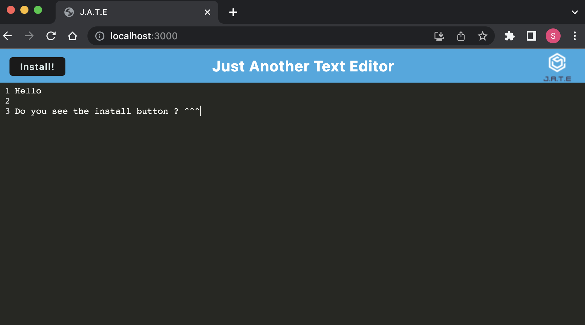

# PWA Text Editor

## **Desription**

This application is a note taking app that allows users to save notes and code snippets even when they are offline.

## **Installation**

To install all the dependencies run npm i in the terminal. To intall the app, simply click the install button at the top left corner.

## **Usage**

To use this app you just need to start typing. All notes will be saved to idb wwhen then user 'loses foucus'. Anytime the user clikcs anywhere on the DOM when they are no longer typing, the data will be saved.

